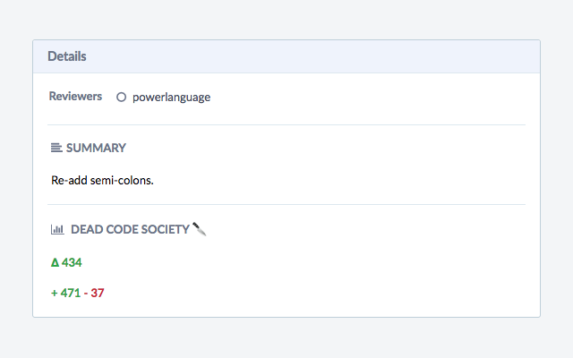

# Dead Code Society 🔪

Chrome extension to display count of lines changed when viewing a phabricator diff.

## [Download from the Chrome Web Store](https://chrome.google.com/webstore/detail/dead-code-society/cmbcdghbiahaepmiebkghbllhbkgigni/)

Counts the total lines added, total lines removed and relative lines changed (delta) of a diff and displays them in the diff details.

